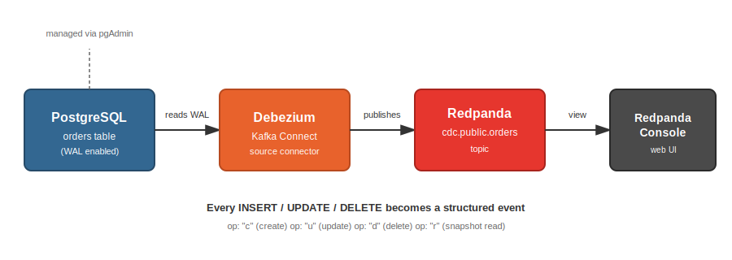
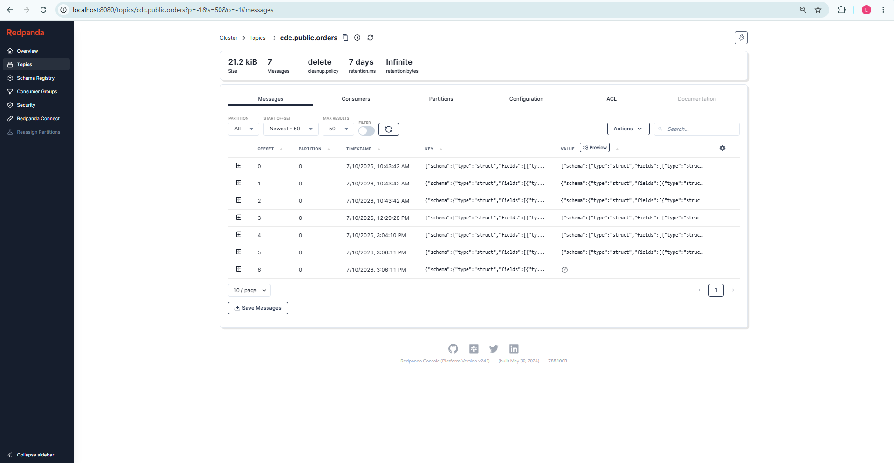
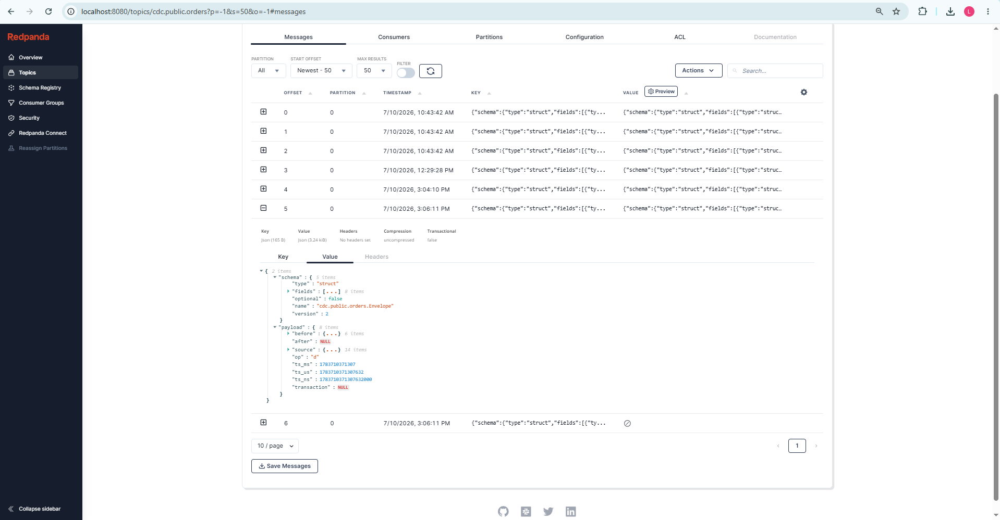
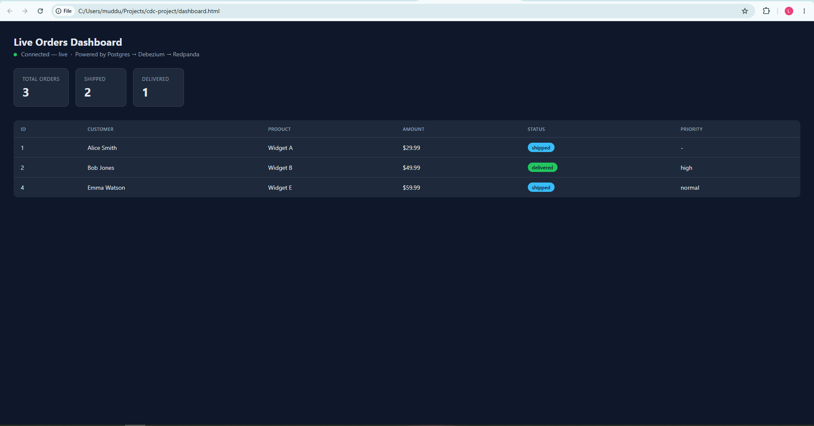

# Real-Time CDC Pipeline

A local, fully open-source Change Data Capture (CDC) pipeline: **Postgres → Debezium → Redpanda**.
Every insert, update, and delete on the `orders` table is captured directly from the Postgres
write-ahead log (WAL) and streamed as a structured event in real time — no polling, no triggers,
sub-second latency.



## Stack
- **Postgres 16** — source database, logical replication enabled
- **Debezium 2.6** (Kafka Connect) — reads the WAL, emits change events
- **Redpanda** — Kafka-API-compatible message broker (lighter than running real Kafka + Zookeeper)
- **Redpanda Console** — web UI to watch events flow through topics in real time
- **Redis** — cache layer kept in sync by a downstream consumer (see below)
- **Python (`websockets`, `kafka-python`, `redis`)** — two downstream consumers built on this pipeline
- **pgAdmin** — used to browse/mutate the source data during development
- **RedisInsight** — used to browse the Redis cache during development

## Why CDC instead of polling?
Traditional "poll for changes" approaches (`WHERE updated_at > last_check`) can't reliably detect
deletes and add latency/load to the source database. CDC reads the database's own transaction log —
the same mechanism Postgres uses for crash recovery — so every change is captured with millisecond
latency, including the exact before/after state of each row, with zero added load on the app that's
writing the data.

## Prerequisites
- Docker Desktop installed and running

## 1. Start the stack

```bash
docker compose up -d
```

Wait ~20-30 seconds for everything to come up healthy. Check with:

```bash
docker compose ps
```

## 2. Register the Debezium connector

```bash
curl -X POST -H "Content-Type: application/json" \
  --data @register-postgres-connector.json \
  http://localhost:8083/connectors
```

Verify it's running:

```bash
curl http://localhost:8083/connectors/orders-connector/status
```

## 3. Watch events flow

Open Redpanda Console at **http://localhost:8080**, go to Topics, and find `cdc.public.orders`.



## 4. Trigger a live change

Connect via pgAdmin (host `localhost`, port `5433`, db `cdcdb`, user `cdcuser`) or the Postgres CLI:

```sql
UPDATE orders SET status = 'shipped' WHERE customer_name = 'Alice Smith';
INSERT INTO orders (customer_name, product, amount, status) VALUES ('Dana Lee', 'Widget D', 39.99, 'pending');
DELETE FROM orders WHERE customer_name = 'Carla Diaz';
```

Watch the corresponding events appear in Redpanda Console within milliseconds. Each event carries
the exact `before` and `after` state of the row:



Every message includes an `op` field marking exactly what happened:

| op | meaning |
|----|---------|
| `r` | snapshot read (initial capture when the connector starts) |
| `c` | create / insert |
| `u` | update |
| `d` | delete |

Deletes are also followed by a Kafka **tombstone** message (a null-value record for the same key) —
this is a standard Kafka convention that marks the key eligible for removal under log compaction.

## 5. Real-time cache invalidation (Postgres → Redis)

A Python consumer (`cdc_to_redis.py`) demonstrates a concrete downstream use case for this
pipeline: keeping a Redis cache automatically in sync with Postgres, with no manual cache-busting
code anywhere in an application layer.

Install dependencies and run it:

```bash
pip install kafka-python redis
python cdc_to_redis.py
```

The consumer reads every event from `cdc.public.orders` and applies it to Redis:

| Debezium `op` | Redis action |
|---|---|
| `r` (snapshot), `c` (insert), `u` (update) | `HSET order:<id>` with the row's current fields |
| `d` (delete) | `DEL order:<id>` |
| tombstone (null value) | ignored |

With the consumer running, any change made in Postgres (via pgAdmin or `psql`) is reflected in
Redis within milliseconds — verified using [RedisInsight](https://redis.io/insight/) to browse the
cache live while making changes.

## 5b. Live dashboard (Postgres → WebSocket → browser)

A second, independent consumer (`dashboard_server.py`) demonstrates a different downstream pattern:
instead of writing to another store, it keeps an in-memory snapshot of every order and **pushes**
live updates straight to any connected browser over a WebSocket — no polling, no page refresh.

Install the one extra dependency and run it:

```bash
pip install websockets
python dashboard_server.py
```

Then open `dashboard.html` directly in a browser. It connects to `ws://localhost:8765` and renders:
- Summary stat cards (total orders, live counts per status)
- A live table of every current order, with changed rows briefly highlighted



Both this dashboard and the Redis cache-invalidation consumer can run **at the same time**, reading
independently from the same `cdc.public.orders` topic — a good illustration of why using a real
streaming broker (rather than, say, a direct database trigger calling a webhook) matters: any number
of independent downstream systems can consume the same event stream without coordinating with each
other or touching the source database again.

Note: Debezium encodes `NUMERIC`/`DECIMAL` columns (like `amount`) in a compact base64-encoded
binary format rather than plain text — `dashboard_server.py` includes a small decoder
(`decode_debezium_decimal`) to convert this back into a normal number for display.

## 5c. Schema evolution — tested live

To confirm the pipeline handles schema changes gracefully (a common real-world failure point for
CDC systems), a new column was added to the source table while the full pipeline was running:

```sql
ALTER TABLE orders ADD COLUMN priority VARCHAR(10) DEFAULT 'normal';
UPDATE orders SET priority = 'high' WHERE customer_name = 'Bob Jones';
```

**Result:** Debezium picked up the new column automatically — no connector restart or config change
required — and included it in the next event's schema and payload. The Redis consumer, written
generically (it writes whatever fields exist in the event's `after` object rather than hardcoding
column names), picked up the new `priority` field with zero code changes.

One caveat worth noting: Redis only reflects the new field for rows that received a new event
*after* the schema change — existing cached rows aren't retroactively updated until they're next
touched. This is expected CDC behavior, not a bug, but worth being aware of when reasoning about
cache freshness after a schema migration.

## 6. Tear down

```bash
docker compose down -v
```

## What I learned building this
- How Postgres's write-ahead log (WAL) works and why `wal_level=logical` + `REPLICA IDENTITY FULL`
  are required for Debezium to capture full before/after row images
- The difference between query-based CDC (polling) and log-based CDC, and why log-based CDC is the
  industry-standard approach for production systems
- How Kafka Connect source connectors work, using Debezium as a concrete example
- Debugging a stubborn WSL2/Docker Desktop environment issue down to an outdated inbox WSL kernel —
  a good reminder that infrastructure problems are rarely where they first appear to be

## Next steps
- [x] Python consumer that reads `cdc.public.orders` and applies changes to Redis (cache invalidation)
- [x] A second consumer that pushes live updates to a WebSocket-powered dashboard
- [x] Tested schema evolution live (see above)
- [ ] Handle multiple tables in a single pipeline
- [ ] Add retry/error handling and dead-letter logic to the consumers

## License
MIT — see [LICENSE](LICENSE)
